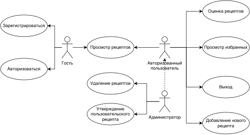
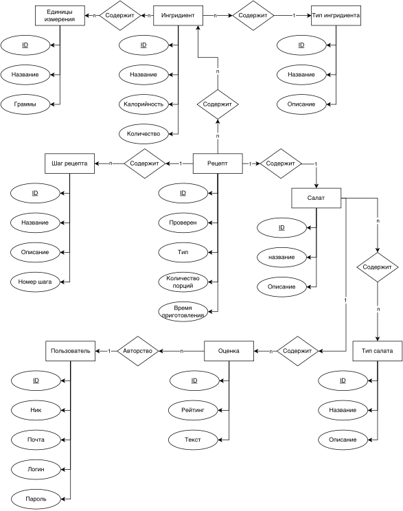
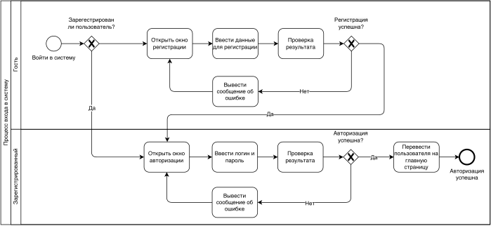
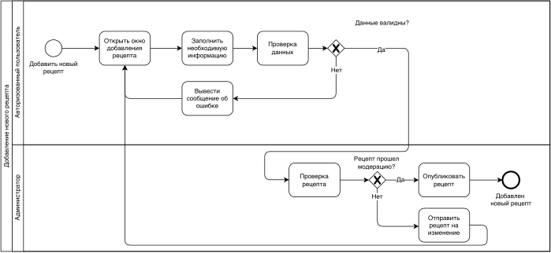
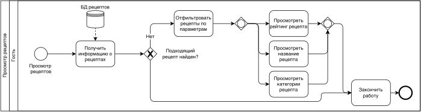
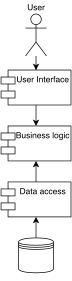
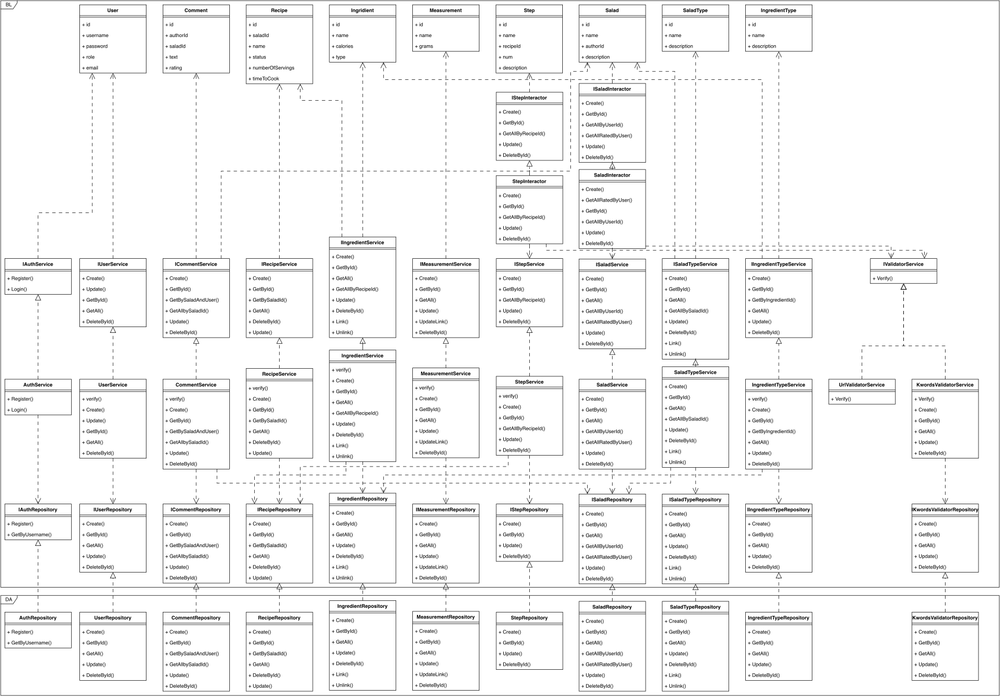

# сервис поиска рецептов салатов

## Краткое описание идеи проекта
Данное приложение предоставляет возможность просмотра рецептов салатов, основываясь на различных параметрах фильтрации, с целью отбора наиболее подходящих. Также представлена исчерпывающая информация о каждом салате. Есть возможность просмотра всех представленных рецептов на основе выбранных продуктов.

## Краткое описание предметной области
Предметная область - рецепты салатов. Салаты могут состоять из разлинчых ингредиентов и принадлежать некоторым категориям, что позволяет пользователю выбрать наиболее подходящий в соответствии со своими предпочтениями.

## Краткий анализ аналогичных решений
| Название | Возможность выбора используемых ингредиентов | Возможность оценки рецептов | Возможность добавление рецептов пользователем | 
|-------------|---|---|---|
| [Вкусвилл Медиа](https://vkusvill.ru/media/recipes/salaty/)    | - | + | + |
| [RussianFood](https://www.russianfood.com/recipes/bytype/?fid=35)| + | - | + |
| [TopFood](https://topfood.club/reczeptyi/salatyi/) | - | + | - |
| Предлагаемое решение  | + | + | + |

## Краткое обоснование целесообразности и актуальности проекта
Некоторые люди в поиске потенциальных блюд для приготовления сталкиваются с проблемой отсутствия обширной информации о рецептах, которые они могут повторить без необходимости в дополнительных действиях по поиску нужных ингредиентов. Данное приложение призвано помочь найти рецепты, содержащие указазанные ингрединеты, имеющие рейтинг не меньше заданного, а так же выбранные категории.

## Краткое описание акторов
|Роль|Описание |
|--|--|
|**Гость**|Пользователь неавторизованный в систему. Может просматривать пецепты, но не может оставлять оценки.
|**Авторизованный пользователь**|Пользователь, который произвел вход в учетную запись, либо создавший новую. Есть доступ к дополнительным функциям, таким как добавление рецептов в избранное, оценивание рецпетов.|
|**Администратор**|Пользователь с повышенными привилегиями, который контролирует общую работу. Есть доступ ко всем функциям и настройкам. Также имеют возможность удалять пользовательские рецепты.|
   
## Use-Case - диаграмма

## ER-диаграмма сущностей

## Пользовательские сценарии
1. Гость зашел на главную страницу, с помощью фильтров ограничил выборку (с указанием используемых ингридиентов, минимального рейтинга, категорий) и получил список подходящих рецептов.
2. Администратор удалил выбранный рецепт;
3. Авторизованный пользователь оставил оценку рецепту;
4. Редактирование рецепта.

## Сложные сценарии
- авторизация;
- добавление нового рецепта авторизованным пользователем с последующим подтверждением от администратора (кроме проверки корректности введенных значений, рецепт не должен содержать некоторые ключевые слова, хранящиеся в базе данных, а так же ссылки).

## Формализация ключевых бизнес-процессов

## Тип приложения
Web MPA

## Технологический стек
- Backend: Golang
- Frontend: HTML, CSS, JS
- Database: PostgreSxQL
  
## Верхнеуровневое разбиение на компоненты

## Диаграмма классов

